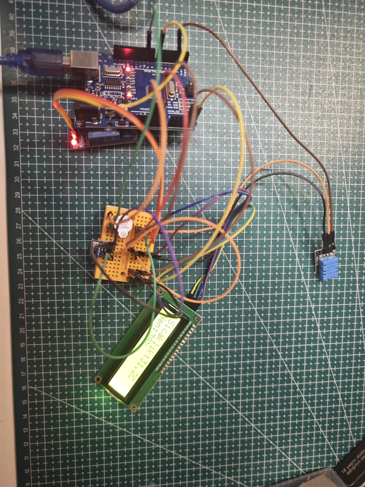
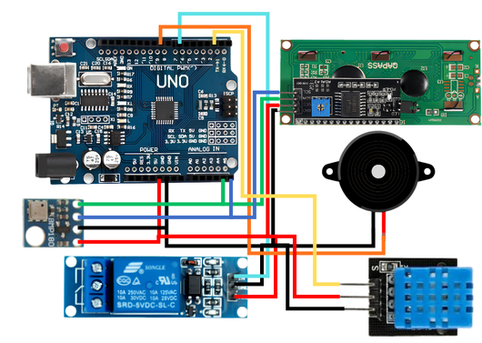
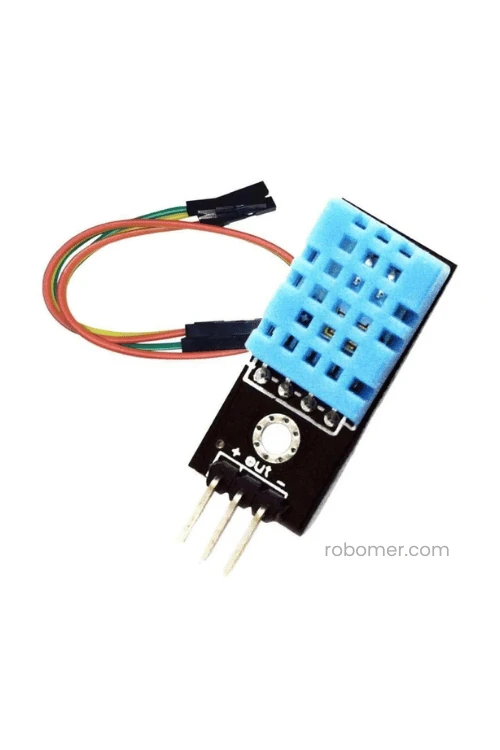
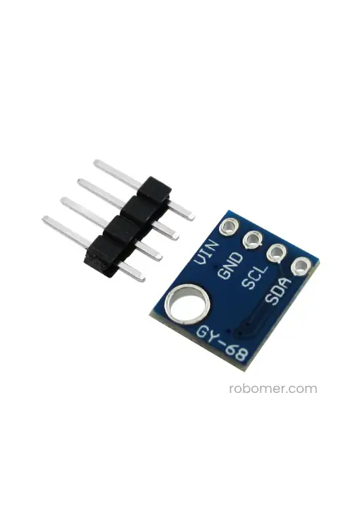
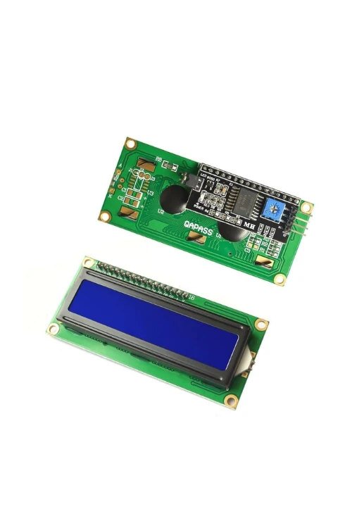

# Robomer Hava Durumu Proje Seti

Arduino ile sıcaklık, nem, basınç ve alarm durumunu takip etmeye yönelik hazırlanmış **Robomer Hava Durumu Proje Seti** için örnek proje arşividir.

Bu repo; set içerisindeki parçaların ne işe yaradığını, hangi pinlere bağlandığını, örnek test kodlarını ve LCD ekranlı hava durumu istasyonu projesini düzenli şekilde paylaşmak için hazırlanmıştır.

> Ürün sayfası: [Robomer Hava Durumu Proje Seti](https://robomer.com/h2hava-durumu-proje-seti-h2-h3br-h3h3urun-aciklamasi-h3-hava-durumu-proje-seti--cevresel-veri-toplama-ve-gorsellestirme-projeleri-gelistirmek-isteyenler-icin-hazirlanmis)  
> Proje blogu: [Arduino ile LCD Ekranlı Hava Durumu İstasyonu Nasıl Yapılır?](https://robomer.com/blog/arduino-ile-lcd-ekranli-hava-durumu-istasyonu-nasil-yapilir)  
> YouTube videosu: [VIDEO_URL_BURAYA](VIDEO_URL_BURAYA)

---

## Proje Görseli



---

## Bu Repo Ne İçeriyor?

| Klasör / Dosya | Açıklama |
|---|---|
| `projects/lcd-hava-durumu-istasyonu/` | Ana Arduino hava durumu istasyonu projesi |
| `src/hava_durumu_istasyonu/` | LCD ekranlı ana proje kodu |
| `examples/dht11_test/` | DHT11 sıcaklık ve nem sensörü test kodu |
| `examples/bmp180_test/` | BMP180 basınç sensörü test kodu |
| `examples/i2c_scanner/` | I2C LCD ve BMP180 adres kontrol kodu |
| `docs/baglanti-semasi.md` | Bağlantı notları ve pin eşleştirmeleri |
| `docs/sorun-giderme.md` | En sık karşılaşılan hatalar ve çözümleri |
| `assets/images/` | Proje, devre ve parça görselleri |

---

## Ana Proje

### [Arduino ile LCD Ekranlı Hava Durumu İstasyonu](projects/lcd-hava-durumu-istasyonu)

Bu projede Arduino UNO kartı ile çevresel veriler okunur ve 16x2 LCD ekranda gösterilir.

Projede kullanılan temel ölçümler:

- **DHT11** ile ortam sıcaklığı ve nem ölçümü
- **BMP180** ile barometrik basınç ve sıcaklık ölçümü
- **16x2 I2C LCD** ile verilerin ekranda gösterilmesi
- **Buzzer** ile sesli uyarı verilmesi
- **5V röle modülü** ile alarm/çıkış kontrolü simülasyonu

---

## Set İçeriği ve Robomer Bağlantıları

| Parça | Projedeki Görevi | Ürün Linki | Blog / Rehber |
|---|---|---|---|
| Arduino UNO R3 Klon + USB Kablo | Ana kontrol kartı | [Ürünü İncele](https://robomer.com/arduino-uno-r3-klon-usb-kablo-hediyeli-usb-chip-ch340) | [Arduino UNO Nedir?](https://robomer.com/blog/arduino-uno-r3-klon-nedir-arduino-uno-ile-baslangic-seviyesi-elektronik-projeleri) |
| 830 Pin Breadboard | Lehim yapmadan devre kurmak için kullanılır | [Ürünü İncele](https://robomer.com/buyuk-breadboard-830-pin)
| DHT11 Isı ve Nem Sensörü | Ortam sıcaklığı ve nem değerlerini okur | [Ürünü İncele](https://robomer.com/dht11-isi-ve-nem-sensoru-modulu-kablo-hediyeli) | [DHT11 Nedir?](https://robomer.com/blog/dht11-nedir-nasil-calisir-arduino-ile-sicaklik-ve-nem-sensoru-kullanimi) |
| BMP180 Basınç Sensörü | Barometrik basınç ve sıcaklık değeri okur | [Ürünü İncele](https://robomer.com/bmp180-dijital-hava-basinc-barometrik-sensor-gy-68) | [BMP180 Nedir?](https://robomer.com/blog/bmp180-nedir) |
| 16x2 I2C LCD Ekran | Ölçülen değerleri ekranda gösterir | [Ürünü İncele](https://robomer.com/16x2-mavi-lcd-ekran---i2c-lehimli) | [I2C LCD Ekran Nedir?](https://robomer.com/blog/i2c-16x2-lcd-ekran-nedir-arduino-ile-i2c-lcd-ekran-kullanimi) |
| Buzzer | Alarm durumunda sesli uyarı verir | [Ürünü İncele](https://robomer.com/5v-aktif-buzzer) | [Buzzer Nedir?]([BUZZER_BLOG_URL_BURAYA](https://robomer.com/blog/buzzer-nedir-aktif-ve-pasif-buzzer-arasindaki-farklar)) |
| 5V Röle Kartı | Alarm çıkışı simülasyonu için kullanılır | [Ürünü İncele](https://robomer.com/5v-1-kanal-role-karti) | [Röle Modülü Nedir?](https://robomer.com/blog/role-nedir-nasil-calisir-arduino-ile-5v-role-karti-kullanimi) |
| Jumper Kablo | Modüller arası bağlantı için kullanılır | [Ürünü İncele](https://robomer.com/40-adet-erkek-erkek-jumper-kablo-10cm)

---

## Proje Mantığı

Arduino, sensörlerden gelen verileri belirli aralıklarla okur. Okunan veriler hem Seri Monitör ekranına yazdırılır hem de LCD ekranda sayfa sayfa gösterilir.

Alarm mantığı şu şekilde çalışır:

| Koşul | Alarm Durumu |
|---|---|
| Sıcaklık eşik değerinin üstüne çıkarsa | Buzzer ve röle aktif olur |
| Nem eşik değerinin üstüne çıkarsa | Buzzer ve röle aktif olur |
| Basınç düşük eşik değerinin altına inerse | Buzzer ve röle aktif olur |
| Değerler normal aralıktaysa | Alarm pasif kalır |

Varsayılan eşik değerleri ana kod içinde düzenlenebilir:

```cpp
float sicaklikAlarmEsigi = 30.0;
float nemAlarmEsigi = 75.0;
float dusukBasincEsigi = 990.0;
```

---

## Görseller

### Devre Şeması



### Kullanılan Parçalar

| DHT11 | BMP180 | 16x2 LCD |
|---|---|---|
|  |  |  |

---

## Hızlı Başlangıç

1. Repoyu indirin veya klonlayın.
2. Arduino IDE üzerinden gerekli kütüphaneleri yükleyin.
3. Devre bağlantılarını `docs/baglanti-semasi.md` dosyasına göre yapın.
4. Önce test kodlarını çalıştırın.
5. Her şey doğruysa ana proje kodunu yükleyin.

Ana proje kodu:

```text
projects/lcd-hava-durumu-istasyonu/src/hava_durumu_istasyonu/hava_durumu_istasyonu.ino
```

Test kodları:

```text
projects/lcd-hava-durumu-istasyonu/examples/dht11_test/dht11_test.ino
projects/lcd-hava-durumu-istasyonu/examples/bmp180_test/bmp180_test.ino
projects/lcd-hava-durumu-istasyonu/examples/i2c_scanner/i2c_scanner.ino
```

---

## Gerekli Arduino Kütüphaneleri

Arduino IDE içinde **Library Manager** üzerinden şu kütüphaneleri yükleyin:

- `DHT sensor library`
- `Adafruit Unified Sensor`
- `Adafruit BMP085 Library`
- `LiquidCrystal I2C`

---


## Dosya Yapısı

```text
hava-durumu-proje-seti/
│
├── README.md
│
└── projects/
    └── lcd-hava-durumu-istasyonu/
        ├── README.md
        ├── LICENSE
        ├── .gitignore
        │
        ├── assets/
        │   └── images/
        │       ├── proje-gorseli.jpg
        │       ├── devre-semasi.png
        │       ├── dht11.jpg
        │       ├── bmp180.jpg
        │       └── lcd.jpg
        │
        ├── docs/
        │   ├── baglanti-semasi.md
        │   └── sorun-giderme.md
        │
        ├── examples/
        │   ├── dht11_test/
        │   ├── bmp180_test/
        │   └── i2c_scanner/
        │
        └── src/
            └── hava_durumu_istasyonu/
```

---

## Robomer

Arduino, sensör, modül, breadboard, jumper kablo ve robotik proje malzemeleri için:

[robomer.com](https://robomer.com)

---

## Lisans

Bu proje Robomer Eğitim İçeriği Lisansı ile paylaşılmıştır.

Kodlar eğitim, kişisel kullanım ve öğrenme amacıyla kullanılabilir. Robomer logosu, ürün görselleri, proje görselleri, blog metinleri ve marka unsurları Robomer'e aittir.
